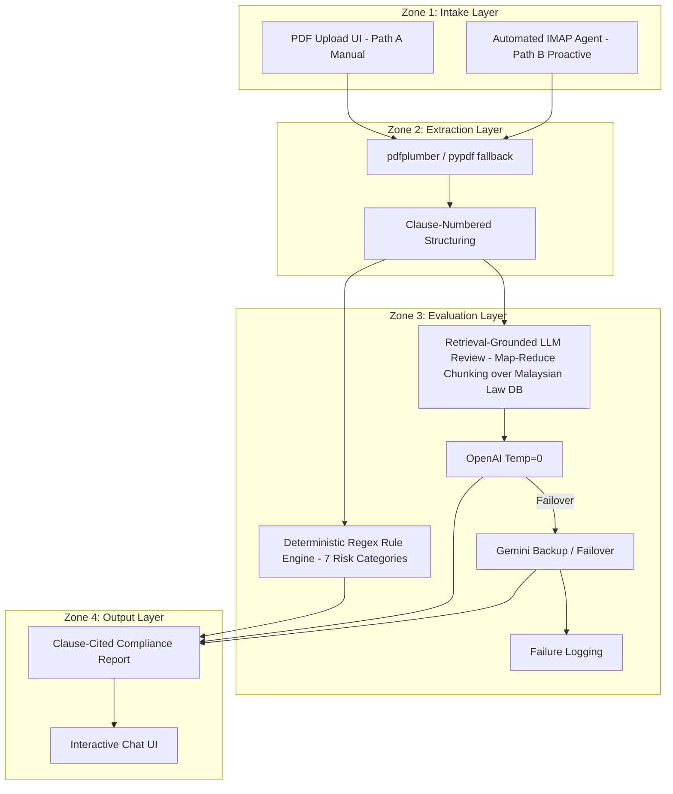

# 📂 ContractSense — Pitch Deck

**Team Name:** 404 Not Found  
**Team Members:** Goh Xuan Hui, Ng Ying Xi  
**Event:** NexHack 2026  
**Focus:** AI-powered Compliance Checking for Malaysian SMEs  

---

## Slide 1: ContractSense
*AI-powered Compliance Checking*
- **Team Name**: 404 Not Found
- **Team Members**: Goh Xuan Hui, Ng Ying Xi
- **Platform**: ContractSense Pitch Deck NexHack 2026

---

## Slide 2: The Problem
Small and medium businesses (SMEs) in Malaysia face serious challenges when reviewing contracts — from hiring offers to rental and sales agreements. Without affordable legal support, most SMEs sign contracts blind, exposing themselves to financial and legal risks.

*   **High Legal Fees**
    - Hiring a lawyer to review a simple contract costs **RM500–RM2,500**.
    - Most SMEs cannot afford this and end up signing unchecked contracts, risking serious legal exposure.
*   **Complex Laws & Slow Turnaround**
    - Laws like the *Employment Act 1955* and *PDPA 2010* are frequently updated and hard to track.
    - External lawyers take **3–7 days** to review contracts, slowing down hiring and business deals.

---

## Slide 3: Our Solution
ContractSense is an AI-powered contract analysis platform built for Malaysian SMEs. Upload any contract and get instant, affordable legal insights — fully aligned with local laws like the *Employment Act 1955* and *PDPA 2010* — in seconds, not days.

*   **Instant AI Analysis**
    - Our AI engine scans contracts in seconds, flagging risky clauses, missing terms, and legal inconsistencies, with auto edit and export changes.
    - No more waiting 3–7 days for a lawyer — get clear, actionable insights and editing action immediately after upload.
*   **Malaysian Law Ready**
    - ContractSense is trained on Malaysian legal frameworks including the *Employment Act 1955* (2022 amendments) and *PDPA 2010*.
    - SMEs get up-to-date compliance checks at a fraction of the cost of traditional legal fees.

---

## Slide 4: Our Services (Part 1)

### 📂 Contract Manual Scan
- Upload multiple contracts at once
- AI analyzes clauses in real-time
- Precise risk detection & categorization
- Clear actionable recommendations

### 🕒 Review History
- Store previous analyses securely
- Compare contracts side-by-side
- Download compliance reports
- Contract searching & filtering

### 📧 Contract Auto Scan
- Automatic analysis directly from incoming email
- Instant compliance alerts & notifications
- Extreme time saving for operational teams
- Automated keyword & clause detecting

---

## Slide 5: Our Services (Part 2)

### ✏️ Contract Auto Edit
- Automatic inline editing of flagged clauses
- AI-driven suggestions for compliance
- Review changes before applying them

### 📁 File Manager
- Download files in chosen format (PDF, DOCX, TXT, MD)
- Save reviews and contracts to local file manager

### 🤖 AI Chatbot
- Ask questions about Malaysian law and internal policies
- Receive immediate legal reference help and guidance

---

## Slide 6: Product Demo
*(Contract scanner interface showing a PDF upload area, checkbox options for Employment Act 1955, PDPA 2010, Companies Act 2016, and Company Policy, followed by a detailed results view.)*

---

## Slide 7: Technical Architecture

Below is the 4-stage data pipeline designed for high accuracy and data privacy:

- **Zone 1: Intake Layer**: Manual upload via browser or proactive background inbox scanning via automated IMAP agent.
- **Zone 2: Extraction Layer**: Extracted via `pdfplumber` (with `pypdf` fallback) to feed into a structured, clause-numbered parser.
- **Zone 3: Evaluation Layer**: Run through a local Deterministic Regex Engine (evaluating 7 risk categories) and a Retrieval-Grounded LLM review (using OpenAI GPT-4o-mini at Temp=0 with automated failover to Gemini + failure logging).
- **Zone 4: Output Layer**: A detailed clause-cited compliance report and interactive side-by-side chat UI.

---

## Slide 8: Target Market
We target three major customer segments:

1.  **SMEs**: Small & medium enterprises looking to avoid compliance violations and high legal fees.
2.  **HR & Procurement Teams**: Recruiting departments and purchase coordinators managing high volumes of standardized documents.
3.  **Enterprise & SAP Customers**: Larger organizations looking to automate contract intake pipelines before legal sign-off.

---

## Slide 9: Scalable SaaS Model
Designed for long-term customer lifetime value:

| Plan | Pricing | Features Included |
| :--- | :--- | :--- |
| **Free Plan** | **RM 0** | Up to 3 scans/mo, standard Malaysian law checks, community support. |
| **Professional** | **RM 99 / month** | Unlimited scans, custom company policy uploads & updates, full inline suggestions, auto editing, PDF export. |
| **Enterprise / Scale** | **RM 299 / month** | Team workspaces connection, auto-scanning connection, custom regulatory reference files, priority support. |

---

## Slide 10: Technical Roadmap
- **Current**: AI contract analysis, local deterministic rules engine, PDF native highlighting, Content Engine creation.
- **Short Term**: Expand Malaysian legal knowledge base (Employment Act, PDPA, Tenancy Act, Procurement guidelines), OCR support, multilingual analysis.
- **Long Term**: Enterprise-ready APIs, user authentication, audit logs, scalable cloud deployment, and on-premise private LLM deployment.

---

## Slide 11: Business Roadmap
- **Current**: Validate product-market fit with local Malaysian SMEs and tech startups.
- **Short Term**: Partner with legal firms & business associations (SAMENTA, MDEC) and launch the SaaS subscription model.
- **Long Term**: Enterprise contract API licensing, entry into the SAP Marketplace, and ASEAN region expansion.

---

## Slide 12: Thank You!
**ContractSense**  
*Empowering businesses with compliance clarity.*  

**Team Name:** 404 Not Found  
**Team Members:** Goh Xuan Hui, Ng Ying Xi  
